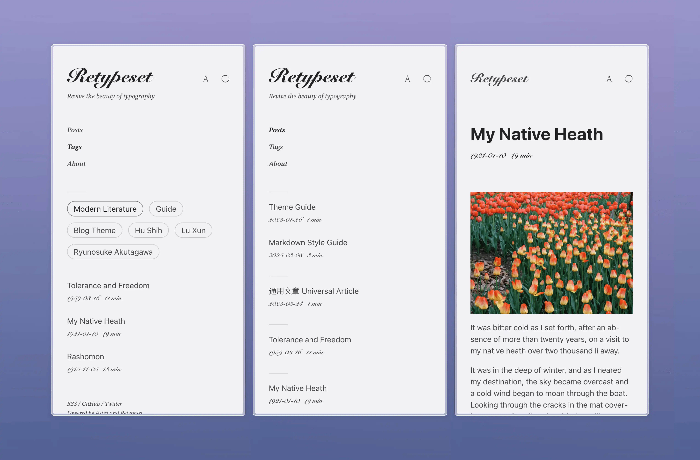

# Retypeset




Retypeset es un tema de blog estático basado en el framework [Astro](https://astro.build/). Inspirado por [Typography](https://astro-theme-typography.vercel.app/), Retypeset establece un nuevo estándar visual y reimagina el diseño de todas las páginas, creando una experiencia de lectura similar a la de los libros impresos, reviviendo la belleza de la tipografía. Detalles en cada mirada, elegancia en cada espacio.

## Demostración

- [Retypeset](https://retypeset.radishzz.cc/en/)
- [Retipografía](https://retypeset.radishzz.cc/es/)
- [Переверстка](https://retypeset.radishzz.cc/ru/)
- [重新编排](https://retypeset.radishzz.cc/)
- [重新編排](https://retypeset.radishzz.cc/zh-tw/)
- [再組版](https://retypeset.radishzz.cc/ja/)

## Características

- Construido con Astro y UnoCSS
- Soporte para SEO, Sitemap, OpenGraph, TOC, RSS, MDX y LaTeX
- Soporte para múltiples idiomas (i18n)
- Modo claro / oscuro
- Transiciones de vista elegantes
- Rica personalización de temas
- Tipografía optimizada
- Diseño responsivo
- Sistema de comentarios

## Rendimiento

<br>
<p align="center">
  <a href="https://pagespeed.web.dev/analysis?url=https%3A%2F%2Fretypeset.radishzz.cc%2Fes%2F&form_factor=desktop">
    
  <a>
</p>

## Primeros pasos

1. [Fork](https://github.com/radishzzz/astro-theme-retypeset/fork) este repositorio, o utilice esta plantilla para crear un nuevo repositorio.
2. Ejecute los siguientes comandos en su terminal:

   ```bash
   # Clonar el repositorio
   git clone <url-del-repositorio>

   # Navegar al directorio del proyecto
   cd <nombre-del-repositorio>

   # Instalar pnpm globalmente (si aún no está instalado)
   npm install -g pnpm

   # Instalar dependencias
   pnpm install

   # Iniciar el servidor de desarrollo
   pnpm dev
   ```

3. Consulte la [Guía del tema](https://retypeset.radishzz.cc/es/posts/theme-guide/) para personalizar su blog y crear nuevos artículos.
4. Consulte las [Guías de implementación de Astro](https://docs.astro.build/es/guides/deploy/) para implementar su blog en Netlify, Vercel u otras plataformas.

&emsp;[](https://app.netlify.com/start) [](https://vercel.com/new)

## Actualizaciones

Retypeset lanza [nuevas características](https://github.com/radishzzz/astro-theme-retypeset/issues/18) de vez en cuando. Simplemente ejecute `pnpm update-theme` para actualizar el tema. Si encuentra conflictos de fusión, consulte [este video](https://youtu.be/lz5OuKzvadQ?si=sH_ALNgqxrYqNVQT) para resolverlos manualmente.

## Créditos

- [Typography](https://github.com/moeyua/astro-theme-typography)
- [Fuwriu](https://github.com/saicaca/fuwari)
- [Redefine](https://github.com/EvanNotFound/hexo-theme-redefine)
- [AstroPaper](https://github.com/satnaing/astro-paper)
- [heti](https://github.com/sivan/heti)
- [EarlySummerSerif](https://github.com/GuiWonder/EarlySummerSerif)

## Historial de estrellas

<p align="center">
<a href="https://star-history.com/#radishzzz/astro-theme-retypeset&Date">
  <picture>
    <source media="(prefers-color-scheme: dark)" srcset="https://api.star-history.com/svg?repos=radishzzz/astro-theme-retypeset&type=Date&theme=dark" />
    <source media="(prefers-color-scheme: light)" srcset="https://api.star-history.com/svg?repos=radishzzz/astro-theme-retypeset&type=Date" />
    
  </picture>
</p>
