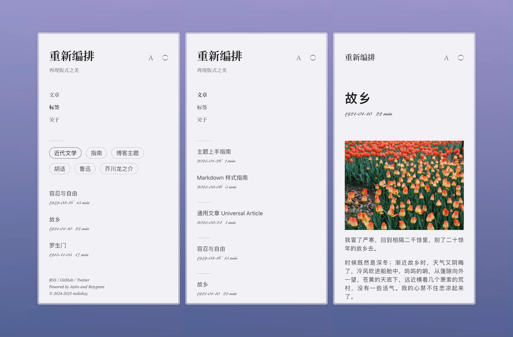

# Retypeset




Retypeset は、日本語では「再組版」と呼ばれる、[Astro](https://astro.build/) フレームワークをベースにした静的ブログテーマです。[活版印字](https://astro-theme-typography.vercel.app/) からデザインのインスピレーションを得て、新しい視覚的な規範を確立し、すべてのページのレイアウトを再構成することで、紙の書籍のような読書体験を提供し、版面の美しさを蘇らせます。見るものすべてが細部にこだわり、限られたスペースの中に優雅さを表現しています。

## デモ

- [重新编排](https://retypeset.radishzz.cc/)
- [重新編排](https://retypeset.radishzz.cc/zh-tw/)
- [再組版](https://retypeset.radishzz.cc/ja/)
- [Retypeset](https://retypeset.radishzz.cc/en/)
- [Retipografía](https://retypeset.radishzz.cc/es/)
- [Переверстка](https://retypeset.radishzz.cc/ru/)

## 特徴

- Astro と UnoCSS で構築
- SEO、サイトマップ、OpenGraph、TOC、RSS、MDX と LaTeX のサポート
- 多言語対応（i18n）
- ライト/ダークモード
- エレガントな遷移アニメーション
- 豊富なテーマカスタマイズ
- 日本語組版の最適化
- レスポンシブデザイン
- コメントシステム

## パフォーマンス

<br>
<p align="center">
  <a href="https://pagespeed.web.dev/analysis?url=https%3A%2F%2Fretypeset.radishzz.cc%2Fja%2F&form_factor=desktop">
    
  <a>
</p>

## はじめに

1. このリポジトリを [フォーク](https://github.com/radishzzz/astro-theme-retypeset/fork) するか、テンプレートとして使用して新しいリポジトリを作成します。
2. ターミナルで以下のコマンドを実行します：

   ```bash
   # リポジトリをクローン
   git clone <リポジトリ URL>

   # プロジェクトディレクトリに移動
   cd <リポジトリ名>

   # pnpm をグローバルにインストール（未インストールの場合）
   npm install -g pnpm

   # 依存関係をインストール
   pnpm install

   # 開発サーバーを起動
   pnpm dev
   ```

3. [テーマ使用ガイド](https://retypeset.radishzz.cc/ja/posts/theme-guide/) を参照して、ブログをカスタマイズし、新しい記事を作成します。
4. [Astro デプロイガイド](https://docs.astro.build/ja/guides/deploy/) を参照して、ブログを Netlify、Vercel などのプラットフォームにデプロイします。

&emsp;[](https://app.netlify.com/start) [](https://vercel.com/new)

## アップデート

Retypeset は不定期に [新機能](https://github.com/radishzzz/astro-theme-retypeset/issues/18) をリリースしています。`pnpm update-theme` を実行するだけでテーマを更新できます。マージ競合が発生した場合は、[このビデオ](https://youtu.be/lz5OuKzvadQ?si=sH_ALNgqxrYqNVQT) を参照して手動で解決してください。

## 謝辞

- [Typography](https://github.com/moeyua/astro-theme-typography)
- [Fuwriu](https://github.com/saicaca/fuwari)
- [Redefine](https://github.com/EvanNotFound/hexo-theme-redefine)
- [AstroPaper](https://github.com/satnaing/astro-paper)
- [赫蹏](https://github.com/sivan/heti)
- [初夏明朝體](https://github.com/GuiWonder/EarlySummerSerif)

## Star History

<p align="center">
<a href="https://star-history.com/#radishzzz/astro-theme-retypeset&Date">
  <picture>
    <source media="(prefers-color-scheme: dark)" srcset="https://api.star-history.com/svg?repos=radishzzz/astro-theme-retypeset&type=Date&theme=dark" />
    <source media="(prefers-color-scheme: light)" srcset="https://api.star-history.com/svg?repos=radishzzz/astro-theme-retypeset&type=Date" />
    
  </picture>
</p>
