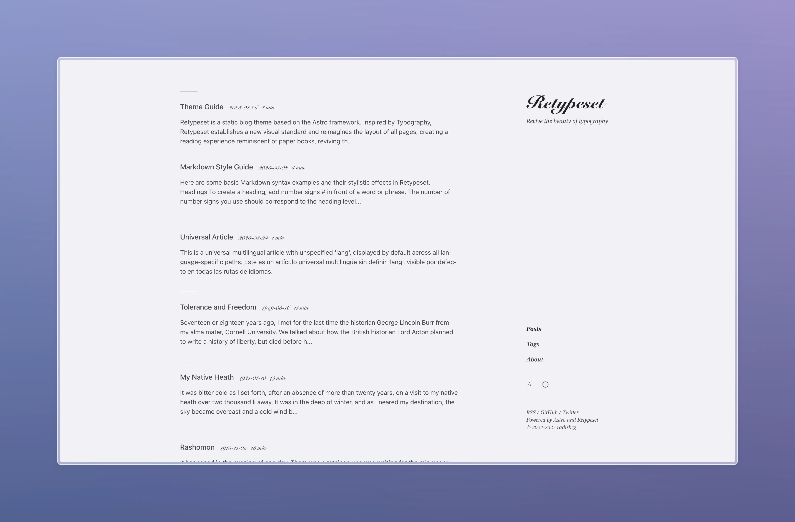
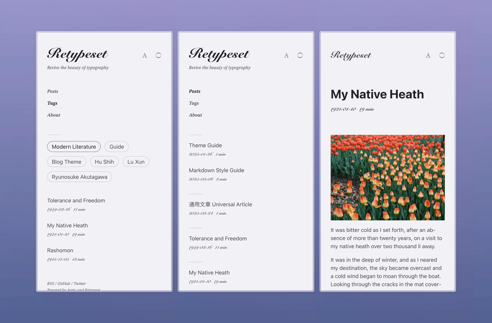

# Retypeset




Retypeset — это статическая тема блога, основанная на фреймворке [Astro](https://astro.build/). По-русски название переводится как «Переверстка». Вдохновленная [Typography](https://astro-theme-typography.vercel.app/), Retypeset устанавливает новый визуальный стандарт и переосмысливает компоновку всех страниц, создавая опыт чтения, напоминающий печатные книги, возрождая красоту типографики. Детали в каждом взгляде, элегантность в каждом пространстве.

## Демо

- [Retypeset](https://retypeset.radishzz.cc/en/)
- [Retipografía](https://retypeset.radishzz.cc/es/)
- [Переверстка](https://retypeset.radishzz.cc/ru/)
- [重新编排](https://retypeset.radishzz.cc/)
- [重新編排](https://retypeset.radishzz.cc/zh-tw/)
- [再組版](https://retypeset.radishzz.cc/ja/)

## Особенности

- Построен на Astro и UnoCSS
- Поддержка SEO, карты сайта, OpenGraph, оглавления, RSS, MDX и LaTeX
- Поддержка многоязычности (i18n)
- Светлый / темный режим
- Элегантные переходы между страницами
- Богатая настройка темы
- Оптимизированная типографика
- Адаптивный дизайн
- Система комментариев

## Производительность

<br>
<p align="center">
  <a href="https://pagespeed.web.dev/analysis?url=https%3A%2F%2Fretypeset.radishzz.cc%2Fru%2F&form_factor=desktop">
    
  <a>
</p>

## Начало работы

1. Сделайте [форк](https://github.com/radishzzz/astro-theme-retypeset/fork) этого репозитория или используйте его как шаблон для создания нового репозитория.
2. Выполните следующие команды в терминале:

   ```bash
   # Клонировать репозиторий
   git clone <url-репозитория>

   # Перейти в директорию проекта
   cd <имя-репозитория>

   # Установить pnpm глобально (если еще не установлен)
   npm install -g pnpm

   # Установить зависимости
   pnpm install

   # Запустить сервер разработки
   pnpm dev
   ```

3. Обратитесь к [Руководство по теме](https://retypeset.radishzz.cc/ru/posts/theme-guide/) для настройки блога и создания новых статей.
4. Обратитесь к [Руководству по развертыванию Astro](https://docs.astro.build/ru/guides/deploy/) для развертывания блога на Netlify, Vercel или других платформах.

&emsp;[](https://app.netlify.com/start) [](https://vercel.com/new)

## Обновления

Retypeset время от времени выпускает [новые функции](https://github.com/radishzzz/astro-theme-retypeset/issues/18). Просто выполните `pnpm update-theme` для обновления темы. Если вы столкнетесь с конфликтами слияния, обратитесь к [этому видео](https://youtu.be/lz5OuKzvadQ?si=sH_ALNgqxrYqNVQT) для ручного разрешения.

## Благодарности

- [Typography](https://github.com/moeyua/astro-theme-typography)
- [Fuwriu](https://github.com/saicaca/fuwari)
- [Redefine](https://github.com/EvanNotFound/hexo-theme-redefine)
- [AstroPaper](https://github.com/satnaing/astro-paper)
- [heti](https://github.com/sivan/heti)
- [EarlySummerSerif](https://github.com/GuiWonder/EarlySummerSerif)

## История звезд

<p align="center">
<a href="https://star-history.com/#radishzzz/astro-theme-retypeset&Date">
  <picture>
    <source media="(prefers-color-scheme: dark)" srcset="https://api.star-history.com/svg?repos=radishzzz/astro-theme-retypeset&type=Date&theme=dark" />
    <source media="(prefers-color-scheme: light)" srcset="https://api.star-history.com/svg?repos=radishzzz/astro-theme-retypeset&type=Date" />
    
  </picture>
</p>
