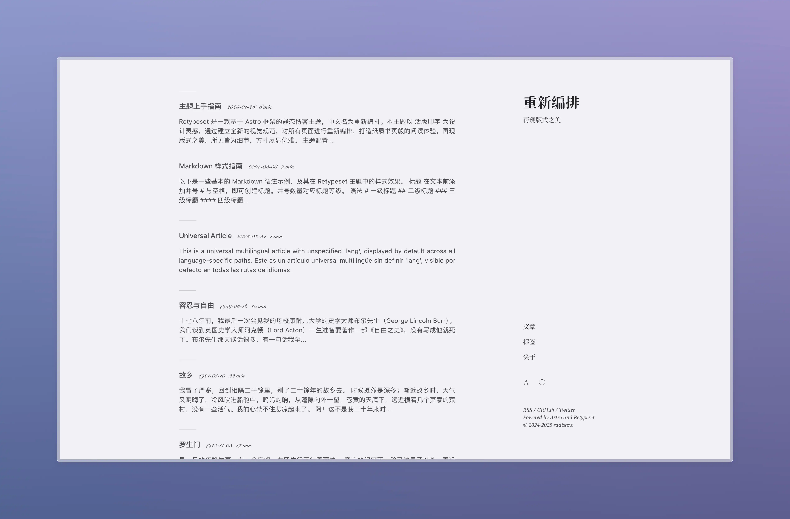
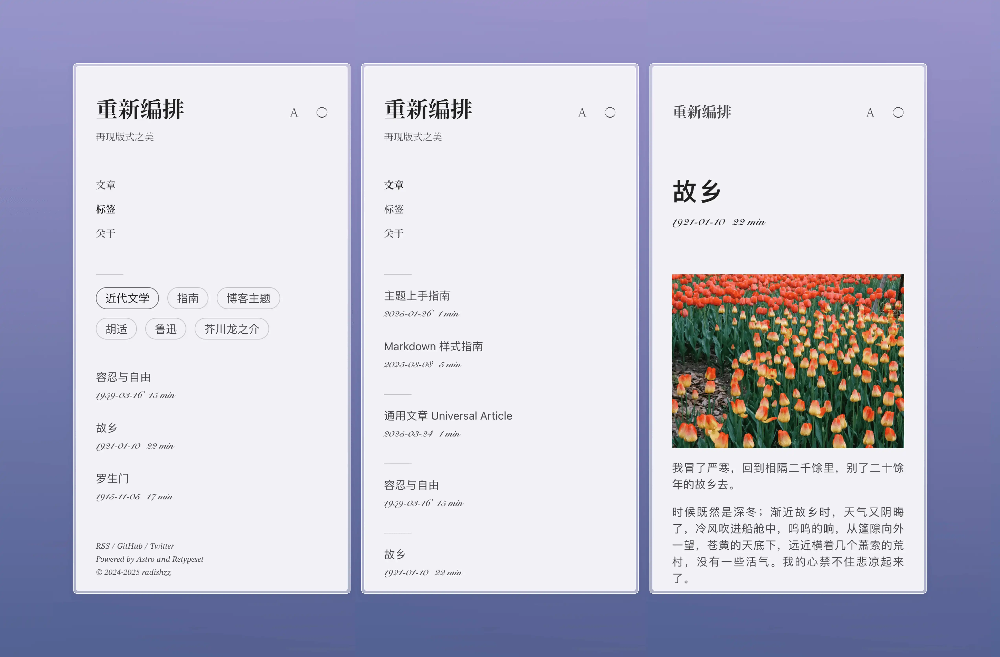

# Retypeset




Retypeset 是一款基於 [Astro](https://astro.build/) 框架的靜態部落格主題，中文名為重新編排。本主題以 [活版印字](https://astro-theme-typography.vercel.app/) 為設計靈感，通過建立全新的視覺規範，對所有頁面進行重新編排，打造紙質書頁般的閱讀體驗，再現版式之美。所見皆為細節，方寸盡顯優雅。

## 預覽

- [重新编排](https://retypeset.radishzz.cc/)
- [重新編排](https://retypeset.radishzz.cc/zh-tw/)
- [再組版](https://retypeset.radishzz.cc/ja/)
- [Retypeset](https://retypeset.radishzz.cc/en/)
- [Retipografía](https://retypeset.radishzz.cc/es/)
- [Переверстка](https://retypeset.radishzz.cc/ru/)

## 特色

- 基於 Astro 與 UnoCSS 開發
- 支援 SEO、Sitemap、OpenGraph、TOC、RSS、MDX 和 LaTeX
- i18n 多語言
- 亮色/暗色模式
- 優雅的過渡動畫
- 豐富的主題配置
- 中文排版優化
- 響應式設計
- 評論系統

## 效能

<br>
<p align="center">
  <a href="https://pagespeed.web.dev/analysis?url=https%3A%2F%2Fretypeset.radishzz.cc%2Fzh-tw%2F&form_factor=desktop">
    
  <a>
</p>

## 開始使用

1. [Fork](https://github.com/radishzzz/astro-theme-retypeset/fork) 此倉庫，或使用此模板創建新倉庫。
2. 在終端執行以下指令：

   ```bash
   # 克隆倉庫
   git clone <倉庫地址>

   # 進入專案目錄
   cd <倉庫名稱>

   # 全局安裝 pnpm（如果未安裝）
   npm install -g pnpm

   # 安裝依賴
   pnpm install

   # 啟動開發伺服器
   pnpm dev
   ```

3. 參考 [主題上手指南](https://retypeset.radishzz.cc/zh-tw/posts/theme-guide/)，自定義你的部落格並創建新文章。
4. 參考 [Astro 部署指南](https://docs.astro.build/zh-tw/guides/deploy/)，將部落格部署至 Netlify、Vercel 等平台。

&emsp;[](https://app.netlify.com/start) [](https://vercel.com/new)

## 更新

Retypeset 會不定期發布 [新功能](https://github.com/radishzzz/astro-theme-retypeset/issues/18)，執行 `pnpm update-theme` 即可更新主題。如果遇到合併衝突，請參考 [此視頻](https://youtu.be/lz5OuKzvadQ?si=sH_ALNgqxrYqNVQT) 手動解決。

## 鳴謝

- [Typography](https://github.com/moeyua/astro-theme-typography)
- [Fuwriu](https://github.com/saicaca/fuwari)
- [Redefine](https://github.com/EvanNotFound/hexo-theme-redefine)
- [AstroPaper](https://github.com/satnaing/astro-paper)
- [赫蹏](https://github.com/sivan/heti)
- [初夏明朝體](https://github.com/GuiWonder/EarlySummerSerif)

## Star History

<p align="center">
<a href="https://star-history.com/#radishzzz/astro-theme-retypeset&Date">
  <picture>
    <source media="(prefers-color-scheme: dark)" srcset="https://api.star-history.com/svg?repos=radishzzz/astro-theme-retypeset&type=Date&theme=dark" />
    <source media="(prefers-color-scheme: light)" srcset="https://api.star-history.com/svg?repos=radishzzz/astro-theme-retypeset&type=Date" />
    
  </picture>
</p>
